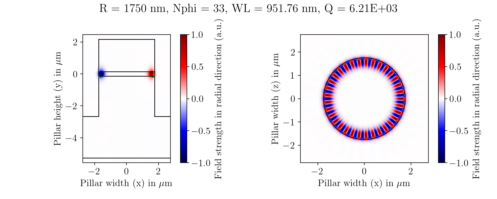

# PyWGM
This project consists of a collection of Python scripts and template files for the commercial FEM solver [JCMsuite](https://jcmwave.com/jcmsuite), aimed at performing automated parameter scans of whispering gallery modes in micropillar laser cavities.

It was created as part of my master's thesis ("Simulation and fabrication of whispering gallery mode micropillar laser cavities  with site-controlled InGaAs quantum dots") and used for a paper published by our workgroup, ["Diameter-dependent whispering gallery mode lasing effects in quantum dot micropillar cavities"](https://opg.optica.org/oe/fulltext.cfm?uri=oe-32-18-31819&id=554738). The results in `res_diascan` show a sample simulation result output from a structure similar but not identical to the one used in my thesis. `project_results` contains the data produced by JCMsuite for the last simulation run of this dataset - saving and publishing the full results for every single step would be too storage intensive, which is why only derived properties are stored in .csv fields.

Please note that this application will be useless without a valid license for JCMsuite. Without a license, results can be viewed, but no simulations can be run.

## Capabilities
PyWGM is primarily a wrapper to simplify parameter scans in JCMsuite. The current software allows to vary the pillar diameter, the size (and existence) of an oxide aperture underneath the cavity, the amount of top DBR pairs, the amount of etched bottom DBR pairs as well as the refractive index inside the cavity. These are all parameter variations I needed for my thesis, but the software is written in a modular way that allows expanding it for other needs without too much effort.

## Computed properties
Since this software runs JCMsuite in (electromagnetic) resonance mode, it can not model any sources (like quantum dots), or overlap between EM modes and gain material. Instead, it computes every possible mode inside the structure, and good guess values are needed (automatically provided by the python software) to lock onto desired modes and keep computation time low.

During a parameter variation run, the software automatically computes and stores the following properties for every single mode found. In addition, mean values and standard deviation are saved once for every diameter and mode type, as this greatly simplifies visualizing trends of parameter studies. All of these parameters are automatically plotted into pdf graphs.

* Resonance frequency
* Mode volume
* Quality factor
* Beta factor
* Purcell factor
* Ratio of mode energy inside and outside of the structure
* Distance from mode maximum to pillar wall
* FSR (free spectral range) 

A simplified plot of the electric field in 2 cross sectional views is plotted for every mode, this allows identifying if the software mistakenly locks onto higher order modes. An example of such a mode plot is visible below:

## Other
If you are using this software, or a derived version, for any scientific work, please cite this repository in the references section. 

Huge thanks to the team at JCMwave for their excellent software, great documentation, and also their very helpful support whenever I reached out with questions or problems.